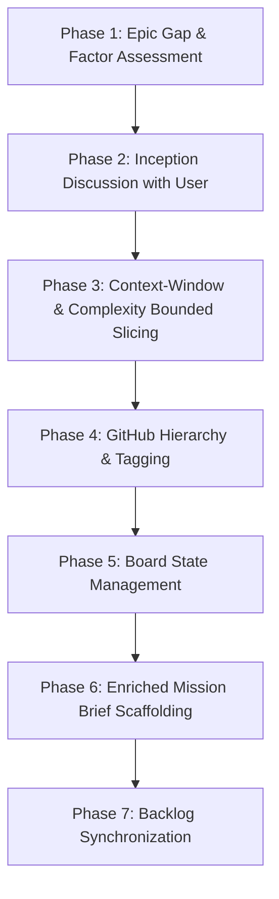

---
description:
---

# Dark Factory Workflow: Epic Inception & Planning (`/plan-epic`)

### v1.0

This workflow governs the inception, gap analysis, decomposition, and dispatch planning for a new Epic in Dark City (equivalent to a Dark Factory Sprint Planning session).

**Lead Facilitator:** Steward
**Technical Co-Lead:** Tech Lead
**Participants:** Character Sculptor, System Architect, World Designer, Local Inference Specialist, QA/Instrumentation Agent, and the User.

---

## 1. Process Overview & Inception Flow



---

## 2. Planning Phases

### Phase 1: Epic Gap & Factor Assessment

1. **Audit Backlog Spec:** Read the target Epic in `docs/backlog.md`, its referenced World Blueprint sections, and Design Foundations.
2. **Codebase Baseline Check:** Inspect the existing codebase to verify whether prerequisite schemas, traits, or components are in place.
3. **Identify Open Factors:**
   - Architectural gaps or unratified design forks.
   - Cross-crate boundary crossings or missing DTOs.
   - Inference/grammar requirements or scenario dependencies.
   - Unresolved questions from reference papers or prior phase findings.

### Phase 2: Inception Discussion with User

1. **Structured Presentation:** Present identified gaps, design alternatives, and dependency risks to the User.
2. **Interactive Alignment:** Resolve design decisions with the User.
3. **Documentation Ratification:**
   - Log any new architecture decisions in `decisions/` using the `decision-log-entry` skill.
   - Capture any new work items for inclusion in the backlog and current iteration.
   - Update Blueprint or proposal drafts if specs were modified.

### Phase 3: Context-Window & Complexity Bounded Slicing

Decompose Epic stories into cohesive, executable task issues using **Context-Window & Complexity Bounded Slicing**:

- **Single-Session Capacity:** Every task must be sized to be fully understood, implemented, tested, and verified within a **single developer agent session** without blowing context limits.
- **Avoid Micro-Task Thrash:** Do not fragment cohesive work into trivial micro-tasks that unnecessarily spread related work. Group related capabilties into one cohesive unit where possible without violating session capacity.
- **Avoid Monolithic Overreach:** Never combine multi-crate changes or multi-system loops into a single unreviewable task.
- **Single Owner Principle:** Every task belongs strictly to one role ownership ([Team Charter §3.1](../../docs/project-charter.md#3-team-structure)).

### Phase 4: GitHub Hierarchy & Tagging

1. **Create Epic & Story/Task Issues:**
   ```bash
   scripts/gh-issue-ops.sh create --title "[Epic ID] Epic Title" --label "type:epic" --status "Backlog"
   scripts/gh-issue-ops.sh create --title "[Story ID] Story Title" --label "type:story" --status "Backlog" --parent <epic_issue_num>
   scripts/gh-issue-ops.sh create --title "[Task ID] Task Title" --label "type:task,domain:backend" --parent <story_issue_num> --estimate 5
   ```
2. **Standardized Labels:**
   - **Type Labels:** `type:epic`, `type:story`, `type:task`
   - **Domain Labels:** `domain:backend`, `domain:client`, `domain:cognitive`, `domain:inference`, `domain:instrumentation`, `domain:governance`, `domain:infrastructure`
3. **Native Sub-Issue Linking:** Link child tasks under parent Stories/Epics via `scripts/gh-issue-ops.sh link <parent> <child>`.

### Phase 5: Board State & Clutter Management

- **Actionable Work Items (`Ready`):** Only leaf tasks or unsplit stories ready for immediate development are set to **`Ready`** on [DC Board (Project #2)](https://github.com/orgs/Mindstar-Studio/projects/2).
- **Parent Containers (`Backlog`):** Parent Epics and Stories containing sub-tasks remain in **`Backlog`** to keep the active work queue focused and uncluttered.
  - Parent Epics and Stories are closed with a comment and marked as accepted during the retrospective.

### Phase 6: Enriched Mission Brief Scaffolding

1. Scaffold the initial brief:
   ```bash
   scripts/gh-issue-ops.sh scaffold-brief <story_or_task_id>
   ```
2. **Mandatory Enrichment:**
   - **Steward:** Confirms role assignment, dependencies, issue numbers, and board links.
   - **Tech Lead:** Details target crates, architectural invariants, concurrency constraints, and non-vacuous testing expectations.

### Phase 7: Backlog Synchronization

- Update `docs/backlog.md` with:
  - Dispatched issue numbers.
  - Sliced task descriptions and Gherkin acceptance criteria.
  - Updated estimates and dependency graphs.
