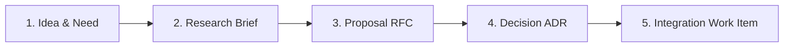

# Dark Factory Proposals & Research Index

This directory manages the end-to-end lifecycle for architectural innovations, cross-boundary proposals, and design explorations within Dark City.

---

## 1. The 5-Stage Proposal Lifecycle

### Stage 1: Idea & Need

An architectural gap, feature opportunity, or literature precedent is identified (e.g., from reference papers, feature/requirement definition, or simulation runs).

### Stage 2: Research Brief (`research-brief-*.md`)

- **Author:** Assigned specialist role or Steward.
- **Purpose:** Frame the core question, analyze literature/precedents, explore candidate design shapes, identify open questions, and propose preliminary backlog sequencing.
- **Template:** Use `proposals/research-brief-template.md`.

### Stage 3: Proposal RFC (`NNNN-short-slug.md`)

- **Author:** Assigned specialist role.
- **Purpose:** Concrete technical specification of what is changing, why, cross-directory impacts, and alternative designs.
- **Review:** Reviewed and refined in an interactive working session between the **Steward**, **Tech Lead**, **Assigned Role**, and the **User**.
- **Template:** Use `proposals/proposals-template.md`.

### Stage 4: Decision ADR (`decisions/NNNN-*.md`)

- When a proposal is approved, the Steward ratifies it into a permanent Architecture Decision Record in `/decisions/` using the `decision-log-entry` skill.

### Stage 5: Integration Work Item

- An approved proposal is translated into concrete backlog deliverables:
  - Documentation and World Blueprint amendments.
  - Epic, Story, and Task issues documented in the backlog and prepared for dispatch in the appropriate epic.
  - If stories will be worked immediately: 
    - Sliced and scheduled into the target tasks per planning epic/story/task guidance.
    - Briefs created and enriched. 

---

## 2. Backlog Sequencing Framework

Every research brief and proposal must evaluate its **backlog insertion point** against project phases:

1. **Immediate Foundational Impact:** If a proposal alters core schemas, database primitives, or multi-tenancy rules required by current work, pause current sprint items to conduct research and integrate the decision immediately.
2. **Deferred / Phase-Aligned Insertion:** If a proposed capability impacts a future phase (e.g. Phase 3 Economy or Phase 2 Events):
   - Sequence the **Research Brief & Spike** into the preceding phase (e.g. Phase 2) so findings are grounded in live simulation data.
   - Schedule the **Decision Gate** as an exit milestone of that phase.
   - Insert the **Implementation Stories** into the target phase backlog without disrupting immediate progress.

---

## 3. Proposals & Research Registry

| ID / Document                                                                                  | Title                                 | Stage          | Requesting Role    | Target Epic / Phase | Status                        |
| :--------------------------------------------------------------------------------------------- | :------------------------------------ | :------------- | :----------------- | :------------------ | :---------------------------- |
| [`research-brief-environmental-world-events.md`](research-brief-environmental-world-events.md) | Environmental & External World Events | Research Brief | System Architect   | Epic 2.7 (Phase 2)  | Pending Phase 2 Spike (2.7.1) |
| [`research-brief-goal-generation.md`](research-brief-goal-generation.md)                       | Citizen Goal Generation               | Research Brief | Character Sculptor | Epic 2.8 (Phase 2)  | Pending Phase 2 Spike (2.8.1) |

---

## 4. Templates

- **Research Brief Template:** [`research-brief-template.md`](research-brief-template.md)
- **Proposal RFC Template:** [`proposals-template.md`](proposals-template.md)
