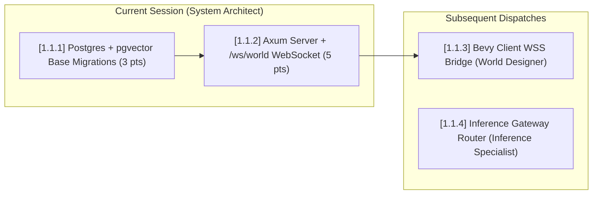

# Dark Factory Mission Brief: Epic 1.1 (Foundational Infrastructure)

**Dispatched Role:** System Architect
**Technical Reviewer:** Tech Lead
**Process Reviewer / Gate:** Steward
**Sprint / Epic:** Epic 1.1 — Foundational Infrastructure (Phase 1: Seed)

---

## 1. Project Context & Current State

The repository bootstrap (**Epic 1.0**) is complete and verified:

- **Workspace Architecture:** A clean Cargo workspace with 6 member crates (`dark_city_core`, `dark_city_inference`, `dark_city_cognitive`, `dark_city_world`, `dark_city_server`, `dark_city_instrumentation`) and [`xtask`](file:///home/brian/dev/ai/worktrees/dark-city/urban-moon/dark-city/xtask/src/main.rs).
- **Quality Baseline:** All 9 unit tests pass across crates, `cargo clippy --all-targets -- -D warnings` is clean, rustfmt is enforced, and `cargo xtask check` runs cleanly.
- **Governance:** The Dual-Gate PR process is in effect ([Team Charter §7](file:///home/brian/dev/ai/worktrees/dark-city/urban-moon/dark-city/docs/project-charter.md#7-definition-of-done-pr-dual-gate)). Technical design rationale has been recorded in [ADR 0001](file:///home/brian/dev/ai/worktrees/dark-city/urban-moon/dark-city/decisions/0001-workspace-crate-structure.md).

---

## 2. Session Scope Recommendation

Epic 1.1 contains four foundational tickets totaling 18 points across three specialist roles. To maintain high code quality, prevent oversized PRs, and avoid cross-boundary context dilution, **this session is assigned to the System Architect for Tickets [1.1.1] and [1.1.2] (8 points total)**.



Completing [1.1.1] and [1.1.2] first establishes the database connection and the live WebSocket endpoint that the World Designer ([1.1.3]) requires to test the Bevy client bridge.

---

## 3. Dispatched Tickets & Acceptance Criteria

### Ticket [1.1.1] Postgres + pgvector Provisioning & Base Migrations

- **Role:** System Architect
- **Directory Ownership:** `/migrations/`, [`crates/dark_city_server/`](file:///home/brian/dev/ai/worktrees/dark-city/urban-moon/dark-city/crates/dark_city_server)
- **Blueprint Reference:** [§2 (System Architecture)](file:///home/brian/dev/ai/worktrees/dark-city/urban-moon/dark-city/docs/dark-city-blueprint.md#2-system-architecture-overview), [§4.1 (Memory Schema)](file:///home/brian/dev/ai/worktrees/dark-city/urban-moon/dark-city/docs/dark-city-blueprint.md#41-schema)
- **Goal:** Set up `sqlx` migrations under `/migrations/` that enable the `vector` extension and establish the base `agents` and `simulation_events` tables.
- **Acceptance Criteria:**
  - `0001_initial_schema.sql` enables `CREATE EXTENSION IF NOT EXISTS vector;`.
  - Base `agents` table created (`id UUID PRIMARY KEY`, `name TEXT`, `created_at TIMESTAMPTZ`).
  - Base `simulation_events` table created with JSONB payload support and index on `agent_id` / `occurred_at`.
  - Migration runner helper implemented in `dark_city_server::db` with connection pool initialization (`PgPoolOptions`).

---

### Ticket [1.1.2] Axum Server Skeleton + World WebSocket Handler

- **Role:** System Architect
- **Directory Ownership:** [`crates/dark_city_server/`](file:///home/brian/dev/ai/worktrees/dark-city/urban-moon/dark-city/crates/dark_city_server)
- **Blueprint Reference:** [§12 (Networking & API Surface)](file:///home/brian/dev/ai/worktrees/dark-city/urban-moon/dark-city/docs/dark-city-blueprint.md#12-networking--api-surface)
- **Goal:** Build the running Axum HTTP + WebSocket router in `dark_city_server`, providing the `/ws/world` endpoint with connection acknowledgment and state broadcast channels.
- **Acceptance Criteria:**
  - Axum router configures `/api/v1/health` and `/ws/world`.
  - Connecting to `/ws/world` successfully upgrades the connection and transmits an initial `{"type": "connection_ack", "server_time": "..."}` JSON payload.
  - A tokio broadcast channel (`tokio::sync::broadcast`) is wired to the WebSocket handler so world events can be published to connected clients.
  - Integration tests in `crates/dark_city_server/tests/` verify both the HTTP health check and the WebSocket handshake/ack.

---

## 4. Engineering Standards & Quality Checklist

Before opening the PR, the System Architect must run through the [Session Start Workflow](file:///home/brian/dev/ai/worktrees/dark-city/urban-moon/dark-city/.agent/workflows/session-start.md) and verify the Dual-Gate Definition of Done:

1. **Tests & Lints:**
   ```bash
   cargo fmt --check
   cargo clippy --all-targets -- -D warnings
   cargo nextest run
   cargo xtask check
   ```
2. **Doc Comments:** Every public struct, function, and error variant must have doc comments explaining _why_ it exists.
3. **No Dead Code:** No commented-out code blocks or orphan TODOs.
4. **Escalations:**
   - For technical/architecture ambiguities, pause at Step 7 and raise to the **Tech Lead**.
   - For scope/ticket boundaries, raise to the **Steward**.

---

## 5. Copy-Paste Session Bootstrap Prompt

To launch the next session for the **System Architect**, copy and paste:

```markdown
You are the System Architect for the Dark Factory team, building Dark City.

Read AGENTS.md and your role file in .agent/roles/system-architect.md if they're not already in context.

Your assigned tickets: [1.1.1] Postgres + pgvector provisioning and [1.1.2] Axum server skeleton + world WebSocket. Pull the goals and acceptance criteria from docs/backlog.md and the Epic 1.1 Mission Brief.

Run Session Start Workflow (.agent/workflows/session-start.md) in full, starting at step 1. Stop at step 7 and report back to the Tech Lead if you hit a technical ambiguity neither the Blueprint nor Foundations resolves.
```
